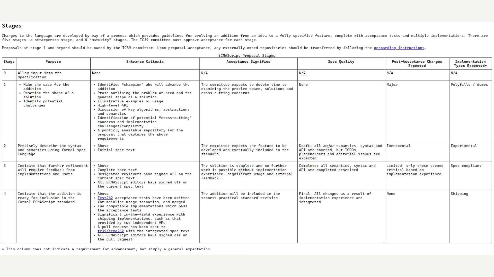

1. History of JavaScript
1.1 What are these ?
    •  ECMAScript
    • JavaScript
    •  ES5
    •  ES6
    •  ES7
    •  ES2015
    •  ES2016
    •  ES2017
    •  ES2018

1.2 - In 1995, there was a popular web-browser known as netscape navigator in which Brendan Eich developed JS in just 10 days and named it "Mocha" then changed into "LiveScript" then lastly changed into "JavaScipt". 
And then in order to beat Netscape Navigator "Internet Explorer" made "JScript" which uses some features of javascript, which caused a bit of difficulty for developers as if they use JavaScript then their website will look good on Netscape Navigator and if they use JScript then it will look good on Internet Explorer.

Then they took JavaScript to ECMA (which standardized different technologies) and made a standard for different web browsers to follow certains standards or rules to follow when using javascript. They named it ECMAScript because the trademark of JavaScript is with oracle. ECMAScript or JavaSCript, the thing is same.

ES5 : 2009(Iots of new features)
ES6 : 2015(Biggest update in the history of js)

1.3 - 
TC 39 (Technical Community 39) - This community select which feature should come in javascript and which not.

Steps which have to be followed in order to add a feature :- .

1.4 - 
Javascript is backward compatible : means if the code was written 20 years ago still it is compatible.

Javascript is not forward compatible : means if I'm using a new feature of JavaScript in 15 years older version of 
web browser then it won't work.
In order to make it work, we can use "BABEL", it is used to transpile means eg. it changes our code from ES6 to ES5 to make it work on older browsers.