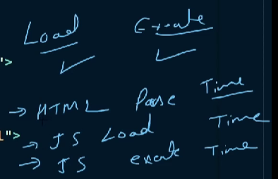

1. HTML and CSS Crash

2. Async vs defer:
- We should not use our javascript file source script on top the html page i.e. inside <b>head tag</b>, mainly because the html file loads from top to down and if we have used some html classes or properties inside js file it will show error as the html file hasn't been <b>loaded/parsed</b> yet.!

- So we think that we should load our script at the end of our body tag... BUT!!! it will take a lot of time to parse everything.

  
It's actually working synchronously.

- Now, I can try to put the script code inside the head again but add a new keyword <b>async</b>
  

        The browser will do two things at the same time i.e. parsing the html file and load the js file. But as soon as the js file get's loaded, browser stops the parsing and the js file will be executed but as the html file was not fully parsed and if i have used elements that are not yet parsed then it will show error.

- The last option which is actually the right one is to add a keyword <b>defer</b>.
  
Browser will again do both things i.e. parsing the html file and loading the js file simultaneously, but this time the parsing of the html file doesn't stop even after the loading of the js file.

