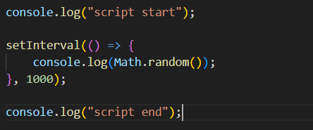
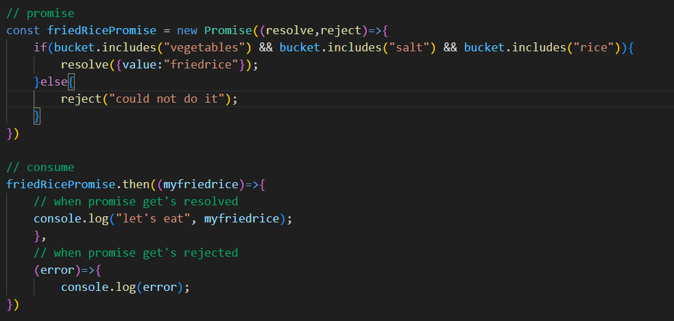
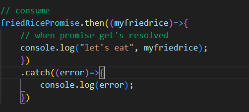

130. Is Javascript a synchronous or asynchronous programming language ? 

- <b>Synchronous:</b>

In a synchronous process, tasks or events occur in a sequential and ordered manner. Each task waits for the previous task to complete before it can start. This mode of operation is similar to people waiting in line for their turn to perform an action. Synchronous communication is immediate and predictable. If a task takes longer to complete, it can delay the entire process.

    The example in the image will give output like this:
        
        script start
        inside for loop  // This line will be repeated 9999 times
        script end

- <b>Asynchronous:</b>
In an asynchronous process, tasks or events can occur independently and simultaneously. Tasks do not necessarily wait for each other to complete, and the order of completion might not be the same as the order they were initiated. Asynchronous communication can improve efficiency and responsiveness, especially when dealing with time-consuming tasks or tasks that don't depend on each other.

- SetTimeout()
This <b>setTimeout()</b> function, will take function as an input and also time, that after how much time after you want to call this function.

    This will give output as:

        script start
        script end
        Hello World!

Now we'll discuss in-depth about the process that our code goes through while executing.

1. `console.log("script start");`: The initial statement is executed synchronously, and "script start" is printed to the console. The call stack contains the <b>global execution context</b>.

2. `setTimeout(() => { ... }, 1000);`: The `setTimeout()` function is called. It's part of the browser's web APIs. Here's how this process unfolds:

    - The setTimeout() function receives an arrow function and a delay of 1000ms as arguments.
    - The browser's web API starts a timer for 1000ms.
    - After the timer expires, the arrow function is moved to the callback queue.\

3. `console.log("script end");`: Another synchronous operation, "script end" is logged to the console.

Now, let's break down how the call stack, event loop, and callback queue work together:
 

- `Call Stack`: The call stack keeps track of the execution context of functions. At the beginning, the call stack contains the global execution context.

    3.1. The `console.log("script start");` statement is executed, and it's added to the call stack.
    
    3.2. The `setTimeout()` function call is added to the call stack.
    
    3.3. The `console.log("script end");` statement is added to the call stack.
    
    - `Event Loop and Callback Queue`: The event loop monitors the call stack and the callback queue. It checks whether the call stack is empty, and if it is, it moves tasks from the callback queue to the call stack for execution.

         - After the timer set by `setTimeout()` expires, the arrow function is moved from the web API to the callback queue.
        - The event loop notices that the call stack is empty and sees a task in the callback queue.
        - The arrow function is moved from the callback queue to the call stack and executed.
        - Inside the arrow function, "Hello World!" is logged to the console.
        - The arrow function is removed from the call stack.
  

    <b>Another Example</b>:
    

1. `console.log("script start");`: The initial statement is executed synchronously, and "script start" is printed to the console.

2. `setTimeout(() => { ... }, 0);`: The `setTimeout()` function is called with a delay of 0 milliseconds. Even though the delay is set to 0, the callback function will still be treated as asynchronous and will be placed in the callback queue after all currently executing synchronous code finishes. This is how the event loop works.

3. `for (let i = 1; i < 10000; i++) { ... }`: The loop is executed synchronously and iterates 9999 times, each time printing "....." to the console. This loop takes some time to complete.

4. `console.log("script end");`: Another synchronous operation, "script end" is logged to the console.

        script start
        (9999 times) .....
        script end
        Hello World!

    Here's why:
    - script start" and "script end" are synchronous operations and are executed immediately, so they are printed in the expected order.

    - The loop runs 9999 times, printing "....." each time. This takes some time to complete, so these messages will be printed before the setTimeout() callback executes.

    - Despite the delay of 0 milliseconds, the callback function specified in setTimeout() is treated as an asynchronous task. It will be placed in the callback queue after the synchronous code (including the loop) completes. Since the loop takes some time, the callback is pushed to the callback queue after the loop finishes.

    - Once the event loop checks the callback queue and finds the setTimeout() callback, "Hello World!" is printed to the console.

    - In summary, even though the delay for setTimeout() is set to 0, the asynchronous behavior of JavaScript ensures that the callback function is executed after the currently executing synchronous code (like the loop) finishes.

        
- <b>Note***</b>: `This setTimeOut()` returns us with a number.

    This `setTimeOut()` was given to the browser and after that it was sen to the callback queue then event loop will check if call stack is empty and then only it will move it to the callstack and the code inside the `setTimeOut()` function will run.

    WE can use this id which `setTimeOut()` function gives and cal another function `clearTimeout(id)` with that id and this function will clear the function from the `callback queue`.

  

131. `setInterval()` 

- `setInterval()`  function in JavaScript is commonly used for executing a given function repeatedly at a specified time interval.

- Working of this is also same as the `setTimeout()`

   

131.1 - Now create `setInterval.html` & `setINterval.css` files and we want to do is that the `setInterval()` function will keep on changing the background color with an interval of 1 sec and as soon as we hit the button it should stop.

- Now this `setInterval()` will give us an `id` and we will use this id to stop the interval.
- Now what we have to do for this is that:

    - We are getting a button from the body and inside the set interval we changing the background color to random `rgb`'s.
    - And after that when `click` event occurs i.e. whenever this button is clicked it will stop the `setInterval()` function by passing the id inside `clearInterval(intervalId)` and we are also changing the text inside the button to the `rgb code`.

132. Callbacks (In general)

- Suppose i want to run a function directly after another function without calling it.

    
    
    - So I want to run `myFunc2()` directly after calling `myFunc()`.
    - I can do that by passing a callback in `myFunc()`.

    
    
    - Alternate:

    
    ---
    - Another Example:

    
    - we can improve this Example by adding validations:
    
    - Alternate:
    

133. Callbacks in Asynchronous Programming
- First of create a js and html file `callback-demo.html`.

- Inside html file write `h1.heading$*7{Hello World}` which will create 7 `h1` headings for us with classes.

- Now I want to change the text of the headings after 1-1 seconds i.e. 1st `h1` will change from `Hello World` to `heading 1`. And in order to do that i can call `setTimout()` function and change the text of headings after `1 sec` delay time.

      Browser Screen:
    
    - And now i want to do this for `heading 2` such that it's text gets change after `heading 1 + 1 sec` i.e. after `2 seconds`. 
    
    
    Browser:

    

    This is not right actually because if I change the delay time of `heading 1` then I also have to change it for `heading 2` as i want the things to be done in ORDER.

    ---
    - Now we can change this to do all of the work in one `setTimout()` function only.

        

        - Working
            
            - The outer setTimeout() is called with a delay of 1000 milliseconds. It schedules its callback function to run after 1 second but doesn't block further execution.
            - Inside the outer callback, heading1 is modified and the inner setTimeout() is set with another 1000 millisecond delay. However, the inner setTimeout() is also non-blocking; it doesn't wait for the delay to finish before moving on.

            - The outer callback completes, and the first setTimeout() is finished.

            - Now, the JavaScript event loop continues checking if there are any tasks that need to be executed. Since the inner setTimeout()'s time has elapsed, its callback is now ready to run.

            - The inner callback is executed, modifying heading2 as intended.
        - Works like a charm BUT!!! it create a nested callback chain which is known as `Callback Hell`. We'll learn to overcome this in the next file where we'll get the help of `Promises`.
    ---
    - Now We can alter this code by creating a function and passing element, text, color, time and 2 callbacks with it i.e. `onSuccessCallback` and `onFailureCallback` for all `10 headings`.
    
        

        - Now i if try for `heading 1` then it works fine

        

        - Now if I want to pass some more headings like:

        

        - This create a `pyramid of doom`

  

134. Intro to Promises

- Promises which was earlier named `future` something which was actually a correct name for it as it's value in not known to us now but in future we will know.

- For example: Suppose I promise you to make some `Fried Rice`. Now the promise will have two things `status` = `pending` & `value` = `null`.

    

    - Now After some time I made `Fried Rice` and now `status` of the promise will come `fulfilled` and value will be the outcome i.e. `Fried Rice`.

    - Now suppose some of the ingredients went missing while making `Fried Rice`, so I'll not be able to make `Fried Rice` and then the `status` of our `promise` becomes `Rejected`.

- Now to create a `promise`, we will use `new` keyword which will act as a contructor function to construct a `promise`. This promise will have a `function` - `Executor Function` which will have two parameters - `resolve` & `reject`. `resolve()` & `reject()` which basically are functions provided by the JavaScript runtime that you call to indicate the outcome of the `asynchronous` operation that the Promise represents.
    

    - `IMP *****` We have `produce` a promise and now we want to `consume` it. 
        - to `consume` it we use the promise and use method `then()` which takes function as an input and this `function` will contain that value which was given when the promise was `resolved`.
        
            
        
        - And we can also pass one more `callback function` to handle the promise if it didn't get resolved.

            

    - We can alter some things like we can even pass an `obejct` inside the `resolve()` and also we change the `reject` by passing an error object `new Error()` 

        

    - Now it's a little bit confusing to add `two callback functions` inside the `then()` function, so i'll use only the `1st callback function` i.e. the `resolve one` and create a chain by using `.catch()`.

        

    - `Note ***`: All this promise task is an `asynchronous` work i.e. all of this work will also be done by the `browser`. `Promise` is a feature of the `browser`. So our promise get's `consumed` by the `browser`.

        We can confirm this by adding a for loop after the whole process of promise and we'll see that the for loop will get `printed/executed` first and then the promise.

    - WORKING:- 

        1. The initial code starts executing in the main thread. "script start" is logged to the console.

        2. The friedRicePromise is created and its executor function runs immediately, checking if the necessary items are in the bucket. In this case, they are present, so the promise is resolved. However, the promise resolution callback is not executed immediately.

        3. The setTimeout() function is called, but since the delay is 0 milliseconds, it doesn't execute immediately. Instead, it is placed in the browser's timer queue/callback queue.

        4. The for loop starts running, logging random numbers and values of i from 0 to 100. This loop takes some time to execute.

        5. The "script end!!!!" message is logged to the console.

        6. `***` The main thread is now free to process items from the task queue. Now the main part which will be executed first the `promise resolution` or `setTimeout()`.

            

        Now Remember one thing, even if 'setTimeout()' was declared before the `promise resolution` will be handled or executed first.This is because microtasks, like promise callbacks, are given higher priority and are executed before the task queue (which contains setTimeout() callbacks).

        7. The .then() callback of the friedRicePromise is executed since it's in the microtask queue. "let's eat { value: 'friedrice' }" is logged to the console.

        8. Now, the microtask queue is empty, and the browser checks the timer queue. The callback from setTimeout() is executed, and "hello from settimeout" is logged to the console.

        

  

135. Function that returns promise:

- We created a promise in the last file but now we want to return it from the function.

    

    - Now we have to just call this function and that we can do when we `consume` it by using `then and catch`.

        

  

136. Promise and settimeout:

- I want to resolve / reject promise after 2 seconds.

    

    

  

137. Promise.resolve and more about then method:

- This `Promise.resolve()` take a value suppose 5 and will return a promise which will be resolved and have a value 5. We'll store it in a variable and can use `.then()` to receive.

    

- Note*** :- This `.then()` method also returns promise which we can use to create a `chain of promises`.

    - To Explain this `chain of promises`, we'll take an example:-

        - So, create a simple promise which will return some text:
        
            

        - Now we'll change or add some value inside `1st .then()` method and return that value and THIS will be like `RETURNING A PROMISE`.!!!

            

        Internally, it's working like this:

            return Promise.resolve(value);
        
